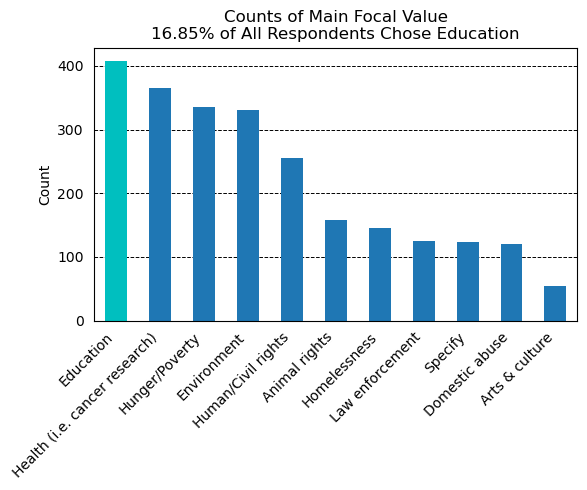

# Analysis of Credit Union Survey Data

This short data analysis project analyzes differences in progressivism among Washington State Employees Credit Union (WSECU) members.

This analysis was originally an assignment for SEIS-631 Data Preparation & Analysis at the University of St. Thomas. The data was provided by Dr. John Chandler.

